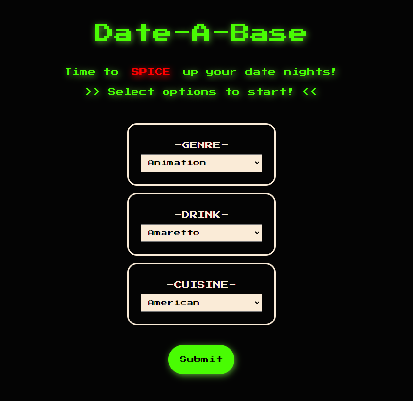

## The Date-A-Base!

### Welcome to The-Date-a-base!

Are you tired of spending endless hours trying to decide what to do for date night? Do you and your significant other find yourselves stuck in a rut of watching the same movies and eating the same meals every week? Well, have no fear, The-Date-a-base is here to save the day!

With just a few clicks, you can choose your preferred movie genre, cuisine, and alcoholic drink, and we'll generate a randomized selection of movie and food/drink recipes using not one, not two, but THREE different APIs. That's right, we went above and beyond to ensure that you and your loved one have the perfect date night.

Our goal is to simplify and add excitement to your date night, so you can focus on what really matters - spending quality time with your partner. No more indecisiveness, no more frustration, just pure bliss.

We used the latest technologies such as HTML, CSS, Javascript, and APIs to bring this website to life. And as you can see from the screenshot, we also made sure to give it a sleek and stylish design that will make you want to use it over and over again.

So what are you waiting for? Head over to our deployed-page and start planning your next date night. Your significant other will thank you, and who knows, you might even thank yourself for finding The-Date-a-base.

## Technologies Used
HTML/CSS/Javascript/APIs

## Many Thanks to...
[MealDB](https://www.themealdb.com/api.php)

[CocktailDB](https://www.thecocktaildb.com/)

[The Movie DB](https://www.themoviedb.org/?language=en-US)
## Deployed Website <3
[LINK](https://thedateabase.com/)

## Screenshots

